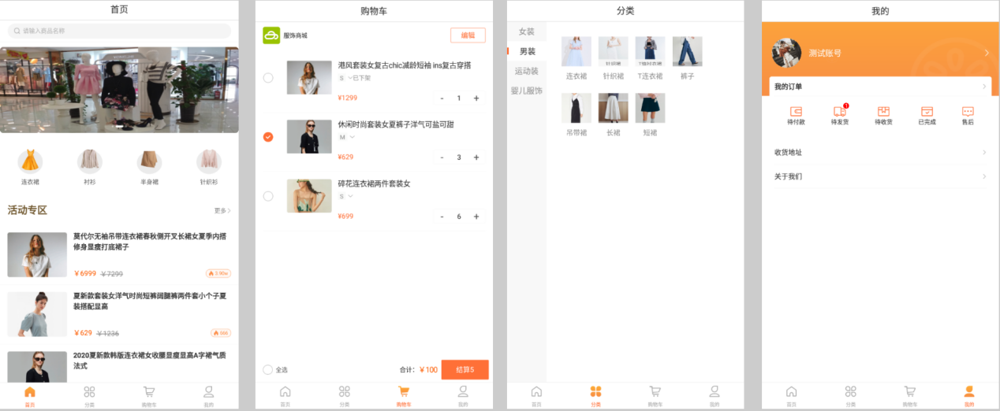
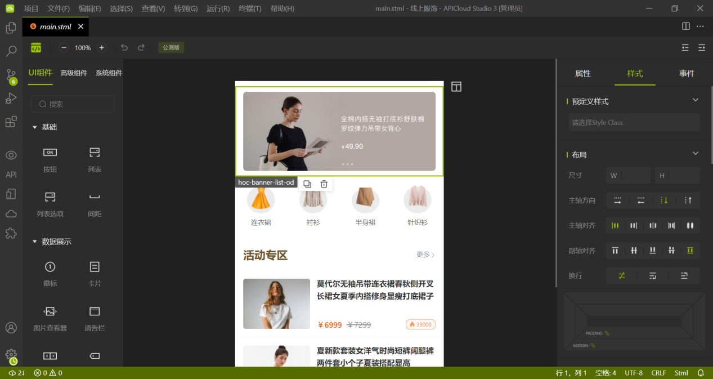
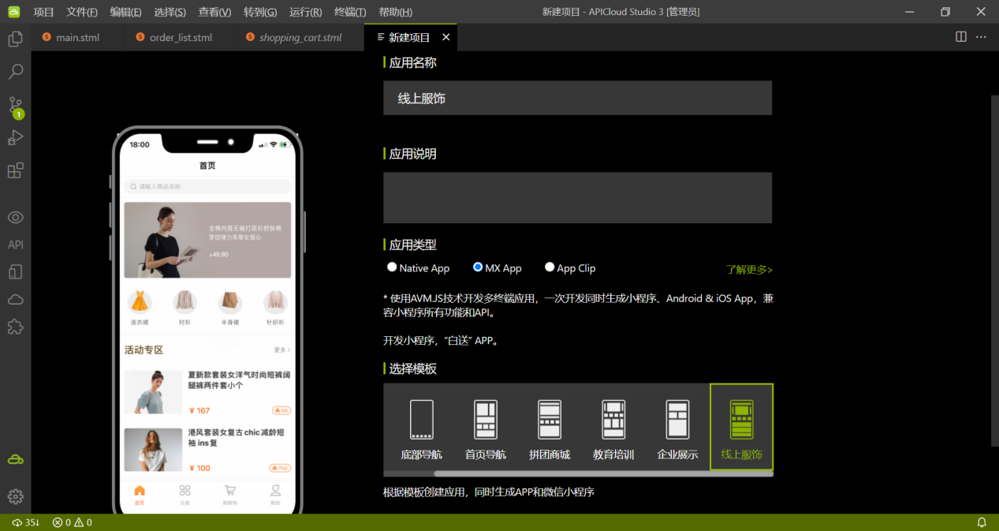
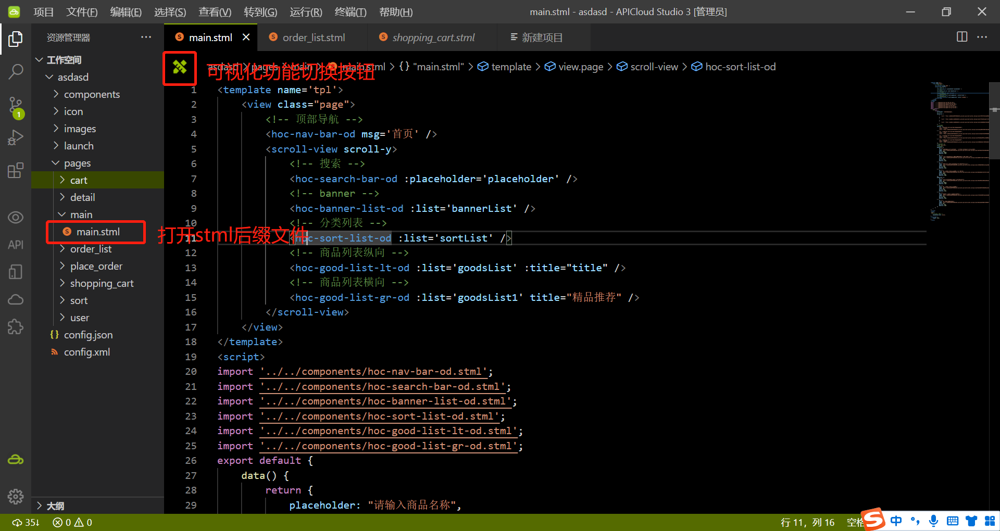
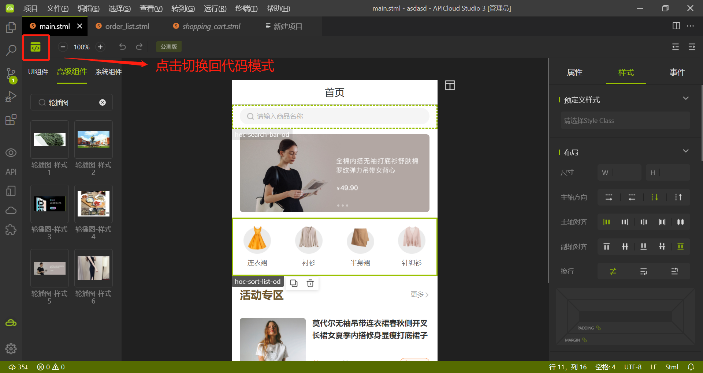

## 线上服饰商城模板说明

### 项目介绍
本模板为在线服饰商城类型，主要功能包括商品展示、商品搜索、购物车、订单管理等。模板中所有页面基于可视化编辑器APICloud Studio3搭建完成，不涉及业务逻辑相关的操作。

### 可视化界面显示以及预览截图

### 源码文件目录结构说明

项目源码在本仓库的 widget 目录下。其中该目录下的文件结构如下：

~~~text
┌─component/                // 项目公共组件目录
│ ├─hoc-banner-list-od.stml // [高级组件]轮播图组件
│ ├─hoc-search-bar-od.stml  // [高级组件]顶部搜索框组件
│ ├─hoc-sort-list-od.stml   // [高级组件]商品分类列表
│ ├─hoc-good-list-lt-od.stml // [高级组件]商品列表纵向
├─images/                   // 图片素材图标资源目录
├─pages/                    // AVM页面目录
│ ├─cart/
│ │ └─cart.stml             // 购物车页
│ ├─detail/
│ │ └─detail.stml           // 商品详情
│ ├─main/
│ │ └─main.stml             // 商城首页
│ ├─order_list/
│ │ └─order_list.stml       // 订单列表
│ ├─place_order/
│ │ └─place_order.stml      // 立即购买
│ ├─shopping_cart/
│ │ └─shopping_cart.stml    // 购 物车页
│ ├─sort/
│ │ └─sort.stml             // 分类列表
│ ├─user/
│ │ └─user.stml             // 我的
│ ├─config.json             // 顶部导航底部导航配置文件
└─config.xml                // 应用配置文件
~~~

### 使用步骤
1、下载最新版本的APICloud Studio 3
2、下载成功后，安装后打开，顶部菜单选择【项目】-【新建项目】，填写应用名称，选择相应模板，点【完成】按钮进行创建。

3、创建完项目后打开stml格式文件，点击左上角图标可切换为可视化界面，可进行页面的设计，左侧栏可根据项目需求拖拽任意组件到画布中，右侧属性设置栏可对拖拽的组件进行设置。具体操作可查看 可视化工具的使用视频。

### 技术支持
使用中若有任何疑问可到APICloud论坛AVM多端专区发帖提问。官方技术支持和众多活跃开发者会第一时间为您提供技术支持。
### 项目地址
https://github.com/apicloudcom/online-dress_lc
